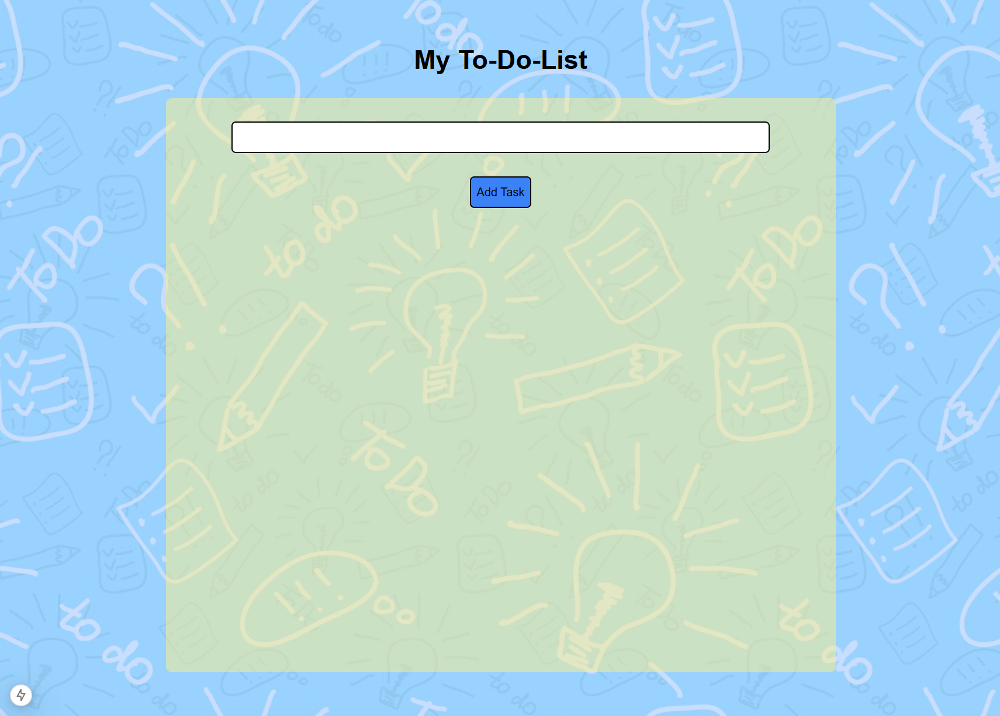

# To-Do App

This is a fully functional and modern To-Do application built with React, Next.js, Tailwind CSS, TypeScript, and a .NET 8 backend connected to MongoDB and deployed via Railway.
The app enables users to add, edit, delete, and mark tasks as completed, all within a clean and responsive interface.

## 🚀 Project Overview

This project demonstrates my full-stack development skills by combining a responsive and modern frontend with a robust backend architecture using .NET. It features full CRUD functionality and persistent storage through MongoDB Atlas, adhering to scalable design principles with a decoupled frontend and backend.

## ✅ Features

Task Management: Add, edit, delete, and mark tasks as completed.

Data Persistence: Tasks are stored in MongoDB and accessed via a RESTful .NET API.

Responsive Design: Optimized for mobile, tablet, and desktop devices.

State Management: Managed with React hooks like useState and useEffect.

Modern Styling: Styled with Tailwind CSS for a clean, professional UI.

Type Safety: Fully typed using TypeScript.

.NET Backend Integration: All data operations are performed via a REST API built with .NET and hosted on Railway.

## 🧩 Components

### TaskApp

Input Form: For adding and editing tasks.

Task List: Dynamically displays tasks retrieved from the backend.

Task Actions: Edit, delete, and toggle the completion status of individual tasks.

## 🔧 Key Hooks & Methods

useState: Manages task input, list state, and editing mode.

useEffect: Fetches tasks on page load and refreshes data after actions.

fetch: Used for API communication (GET, POST, PUT, DELETE) with the .NET backend.

## 🛠 Tech Stack

### Frontend

React
Next.js (App Router)
Tailwind CSS
TypeScript

### Backend

.NET 8 (C#)
MongoDB Atlas
RESTful API (via Controllers)
Hosted on Railway

Development Tools

VS Code
Git & GitHub
Postman (for API testing)
Railway CLI & Dashboard

## ▶️ How to Run the Project

### Frontend

#### 1. Clone the repository
git clone https://github.com/laranjeirapedro/portfolio_project--to-do-list.git

#### 2. Navigate into the directory
cd portfolio_project--to-do-list

#### 3. Install dependencies
npm install

#### 4. Create a .env.local file and add your backend API URL:
NEXT_PUBLIC_API_URL=https://portfolioproject-to-do-list-production.up.railway.app

#### 5. Run the development server
npm run dev

Open http://localhost:3000 in your browser to view the app.

### Backend (.NET)

#### 1. Navigate to your backend directory or clone it separately if needed.

#### 2. Create a .env file or configure environment variables:
MONGO_CONNECTION_STRING=your-mongodb-uri
MONGO_DB_NAME=todoApp

#### 3. Run the API:
dotnet run

The backend will be available at http://localhost:5000 (or your configured port).

## 🌱 Future Enhancements

[ ] User Authentication for private task lists.

[ ] Drag-and-Drop Reordering - Allow users to reorder tasks by priority.

[ ] Due Dates and Reminders - Let users assign due dates and receive notifications.

[ ] Task Categories or Tags - Organize tasks by category or custom tags.

[ ] Dark Mode - Add a theme toggle for better accessibility.

[ ] Progress Tracker - Show progress bars or stats for completed vs. pending tasks.

## ❓ Why This Project?

This project showcases:

Responsive UI and UX with Tailwind CSS.
Frontend logic and state handling with React and TypeScript.
Real-world RESTful API integration using .NET.
Secure, scalable backend with MongoDB Atlas and Railway hosting.

## 🙌 Feedback

If you have any ideas or suggestions to improve the app, feel free to open an issue or pull request!
